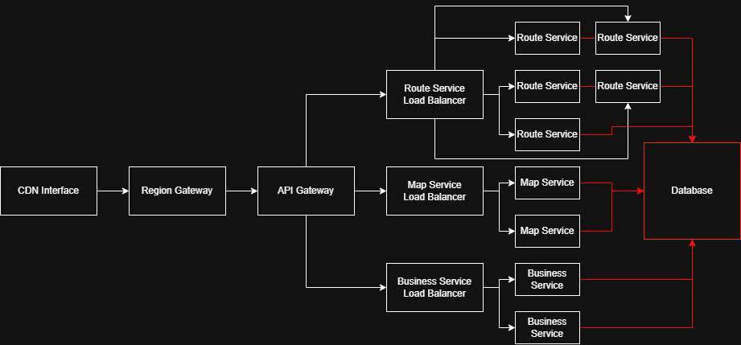

# System Requirements

## Customer Requirements

- Device having a minimal display being able to navigate our website and check results
- Internet access

## Physical Requirements

- Location and its map
- Articles and their mapping

## Software Requirements

- Backend code
- Infrastructure and servers (backend and database)
- Frontend interfaces for all actors

## Scalability Requirements

Any information should be available for anyone in the world but region specific information should be loaded faster for those in proximity.

The architecture of the system, specific to a particular region (e.g. us-east-1): 

It encapsulates all the necessary machines needed to make the system work for a specific region. According to [AWS](https://docs.aws.amazon.com/global-infrastructure/latest/regions/aws-regions.html) there are 34 regions, so the plan is to replicate this architecture for each of those (Each region has its own brain, there is no central brain).

The itinerary of a client requst before hitting our services:

#### 1. CDN Interface

Client interfaces will be running on the CDN servers (here referred as CDN Interface) caching media, javascript, and responses from our backend services. In case of a cache miss, these will redirect the request to our Region gateway.

### 2. Region Gateway

Region Gateway is a simple request forwarding: it call the API Gateway specific to the requested region. It is expected that most of the time the requested region and the "Region Gateway" region to correspond and therefore the latency added between these two steps is minimal. It could also be possible to deploy both gateways on the same machine to achive 0ms latency.

#### 3. API Gateway

The API Gateway does what its name says: service orientated traffic distribution. For example "Route" related APIs are redirected to servers running the routing service.

Some other concerns addressed by either Region Gateway or API Gateway:

- authentication (Employees, Owners)
- rate limiting
- monitoring

#### 4. Load Balancer

Before finally hitting our service server, a load balancer will be placed in front of it to ensure no deployment is overwhelmed. Since the routing is the main feature of our system and it is computationally expensive, multiple instances of `Route Service` are expected to be accepting requests.

# Actors

- (Online, not physically present) **Customer**
  - The actual physical client entering the store
  - Makes product selections accounting their details, prices and offers
- **Employee**
  - His primary responsibility is to manage the location of products (plans the article stand locations in advance, updates them into the system, and finally makes the physical changes required)
  - Also manages offers and discounts
- **Store Owner**
  - Provides the store structure (floors, navigation aisles, etc.) and details (name, operating hours, etc.)
  - Also manages offers and discounts
  - The main attribution is to correctly define the store spaces, both in measurements and directions
- **Brand Owner**
  - Manages the Brand profile (name, logo, etc.)
  - Manages the articles registered within his business
- **System Admin**
  - Manages product caching and route generations

# Resources

## System resources

- Provided by the Customer:
  - **Route** = Optimal in-store navigation path for visiting all the selected articles
- Provided by the Employee:
  - **Floor** = Undirected graph having nodes and edges representing a map component of a store
  - **Node** = Navigation point acting as an intersection between two edges
  - **Edge** = Navigation aisle open to Customers
  - **Stand** = Array of shelves alongside an edge where multiple articles can be placed
- Provided by the Store Owner:
  - **Article** = the brand-specific commercial definition of a product (Price, Currency, Brand)
  - **Product** = Simple product record with details like name, category, or vendor
  - **Store** = physical unit with a brand identity, location, and operating schedule
  - **Offer** = promotional logic linked to articles or stores
  - Provided by the Brand Owner:
    - **Brand** = the legal entity

## Relationships

- 1 Brand <-> 0/∞ Stores
- 1 Store <-> 0/∞ Floors
- 1 Floor <-> 0/∞ Nodes
- 1 Floor <-> 0/∞ Edges
